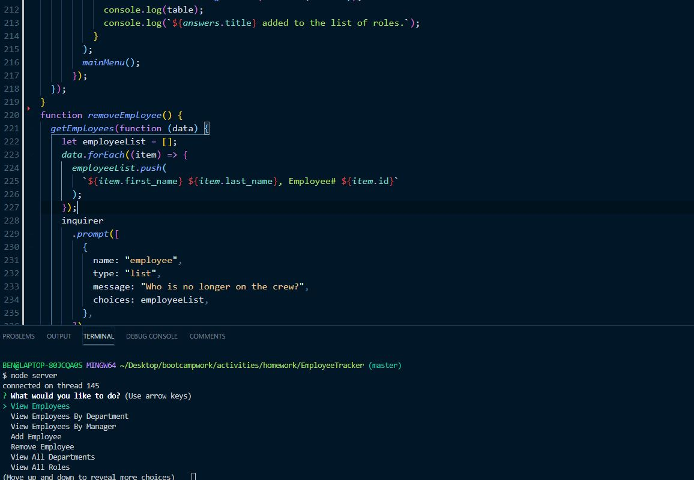

# EmployeeTracker
  
  ## Description 
      This is a command line application that allows for managers/owners to display and change employee information
## Table of Contents
1.[Usage](#Usage)
2.[Contribution](#Contribution)
3.[Questions](#Questions)

## Usage
    This application is a streamiled way for management and company owners to view, add, and change employee information. 
## Installation Requirements
    This program requires the use of npm packages inquirer, mysql, and console.table.            
## Contribution 
    Please contact either Ben de Garcia or Brianna Bullock to work on future iterations
## Questions
  
If you have questions, contact me at [GitHub](https://github.com/bdegarcia).